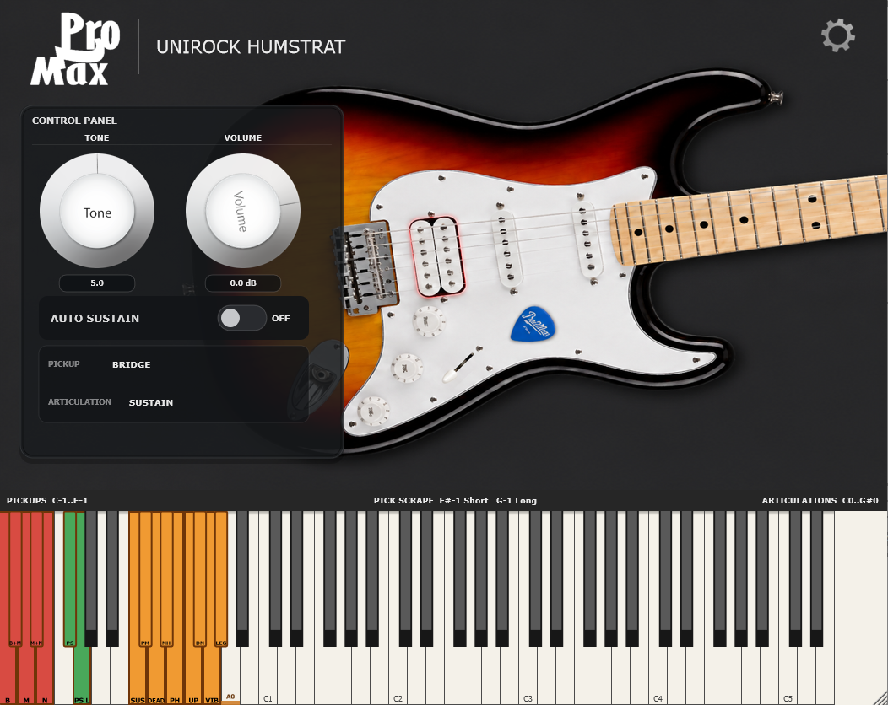

# Pro2Max Unirock HumStrat

Pro2Max Unirock HumStrat is a physically modelled HSS electric guitar instrument for Windows. It ships as a VST3 plugin and as a standalone application.



## What's Included

- VST3 instrument plugin for 64-bit Windows hosts.
- Standalone Windows application.
- A 1.70 GB sample library used for the main sustain sound and performance effects.
- Five pickup positions, guitar articulations, pitch bend, auto sustain, and PickScrape keyswitches.

## Installation

### Installer

Run `Pro2Max_Unirock_HumStrat_1.0.0_Setup.exe`.

The installer places the VST3 plugin in the common 64-bit VST3 folder and installs the standalone application. During installation you can choose where the sample library goes. This can be on another drive, for example `D:\Pro2Max\Unirock HumStrat\Samples`, if your system drive is low on free space.

The installer writes the selected sample library path to:

```text
C:\ProgramData\Pro2Max\Unirock HumStrat\SampleLibraryPath.txt
```

Do not move or rename the sample library folder after installation unless you update that path file or reinstall.

### Portable ZIP

Extract the portable archive to any drive with at least 2 GB free.

Keep this layout:

```text
Your Folder/
  Pro2Max Unirock HumStrat.vst3/
  SampleLibrary/
  README.md
  LICENSE
```

Recommended: add `Your Folder` to your DAW's VST3 scan paths.

If you copy `Pro2Max Unirock HumStrat.vst3` into another VST3 folder manually, copy `SampleLibrary` to the same parent folder too. The plugin finds the library automatically only while the VST3 bundle and `SampleLibrary` remain side by side.

## Controls

### Pickup Keyswitches

Pickup switching is done only by keyswitch. Clicking the guitar image does not change the pickup.

| Key | MIDI note | Pickup |
| --- | ---: | --- |
| C-1 | 12 | Bridge |
| C#-1 | 13 | Bridge + Middle |
| D-1 | 14 | Middle |
| D#-1 | 15 | Middle + Neck |
| E-1 | 16 | Neck |

Pickup keys are red on the on-screen keyboard.

### PickScrape Keyswitches

| Key | MIDI note | Effect |
| --- | ---: | --- |
| F#-1 | 18 | Short PickScrape |
| G-1 | 19 | Long PickScrape |

PickScrape keys are green on the on-screen keyboard. The scrape stops when you release the key.

### Articulation Keyswitches

| Key | MIDI note | Articulation |
| --- | ---: | --- |
| C0 | 24 | Sustain |
| C#0 | 25 | Palm Mute |
| D0 | 26 | Dead Note |
| D#0 | 27 | Natural Harmonics |
| E0 | 28 | Pinch Harmonics |
| F0 | 29 | Slide Up |
| F#0 | 30 | Slide Down |
| G0 | 31 | Vibrato |
| G#0 | 32 | Legato Slide |

Articulation keys are orange on the on-screen keyboard.

Slide Down is a momentary performance command: while a note is ringing, press `F#0` to slide it down. It does not become the next latched articulation.

Legato Slide is overlap-driven: select `G#0`, play a note, then start the next note before releasing the first one.

### Playable Range

The playable guitar range starts at `A0` / MIDI `33`. Notes below the real low E are modelled as a loosened/retuned sixth string.

### Tone, Volume, Auto Sustain

- `Tone`: passive-style brightness control. `10` is fully open.
- `Volume`: master output level.
- `Auto Sustain`: when enabled, released notes continue to decay naturally instead of being hand-damped immediately.

### Pitch Bend

Pitch bend is enabled by default. Open the settings panel with the gear icon to enable/disable pitch bend and set the bend range from 1 to 12 semitones. The default range is 2 semitones.

## Troubleshooting

### The plugin says samples are missing

Use one of these fixes:

- If you used the installer, reinstall and choose the correct sample library folder.
- If you moved the library manually, edit `C:\ProgramData\Pro2Max\Unirock HumStrat\SampleLibraryPath.txt` so it points to the folder containing the WAV files.
- If you use the portable ZIP, keep `SampleLibrary` beside `Pro2Max Unirock HumStrat.vst3`.

### The plugin does not appear in the DAW

Rescan plugins in your DAW. For portable use, add the folder containing `Pro2Max Unirock HumStrat.vst3` to your VST3 scan paths.

### Windows SmartScreen warning

Unsigned freeware installers can trigger SmartScreen on some systems. Verify the SHA-256 hash published with the download before running the installer.

## License Summary

You may use the audio output of this plugin in any project, including commercial music, sound design, games, films, videos, sample packs made from your own musical performances, and client work.

You may not copy, extract, redistribute, sell, repackage, or include the raw sample library or individual sample files in another product.

See `LICENSE` for the full license terms.
